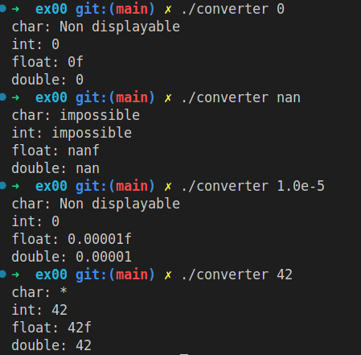
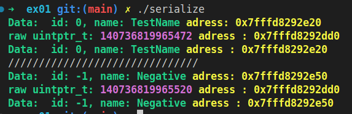

# CPP learning module 06 of 42 School

## Summary

[About the project](#about-the-project)

[Exercices](#exercices)

[Links](#links)

[Screenshots](#screenshot)

## About the project
This project is the `CPP 06` learning module of 42 School.
All the C++ modules are based on C++98.

This project focuses on `type conversion` & `cast`: 

[cast in c++](https://www.geeksforgeeks.org/casting-operators-in-cpp/) that includes the following type of cast & `const_cast` that we  don't need here.
 
[static_cast](https://learn.microsoft.com/fr-fr/cpp/cpp/static-cast-operator?view=msvc-170) that `safely convert` few `basic types` at the compilation. (int -> double, ...)
 
[reinterpret_cast](https://learn.microsoft.com/fr-fr/cpp/cpp/reinterpret-cast-operator?view=msvc-170) 
that do not any conversion but `just read` the bits how they are disposed in the memory and reinterpret them as a the specified type. It can cause problems if used wrongly.
 
[dynamic_cast](https://learn.microsoft.com/fr-fr/cpp/cpp/dynamic-cast-operator?view=msvc-170) that can only be used on polymorph classes. It is used to convert a `pointer` or a `reference` to a `derived type`. It does check at the execution if it worked and return a `nullptr` if not.

## Exercices

### ex00
Create a `ScalarConverter` Class that can't be instanciable. It's used to know what type is a given string and cast it in char int float & double using the `static_cast`.
### ex01
`reinterpret_cast`
### ex02
`dynamic_cast`
## Links

## Screenshot

### `Exercice 00`:

### `Exercice 01`:
